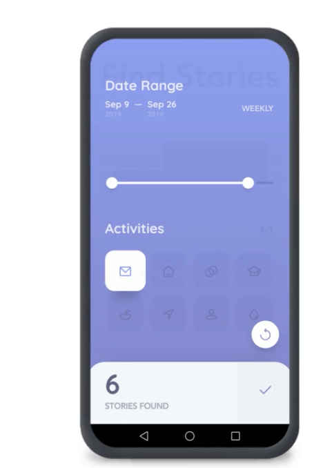
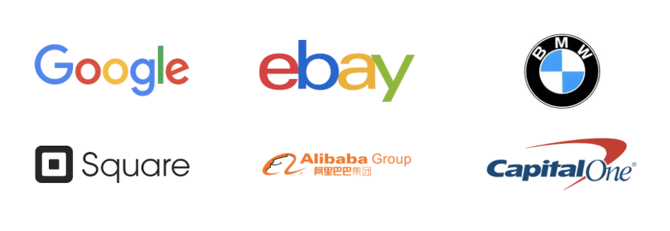

# Flutter-Introduction
## What is Flutter?
`Flutter is Google’s UI toolkit for building beautiful, natively compiled applications for mobile, web, and desktop from a single codebase.`
## Why Flutter?
- **Fast Development!** Paint your app to life in milliseconds with Stateful Hot Reload. Use a rich set of fully-customizable widgets to build native interfaces in minutes.

- **Expressive and Flexible UI!** Quickly ship features with a focus on native end-user experiences. Layered architecture allows for full customization, which results in incredibly fast rendering and expressive and flexible designs.

- **Native Performance!** Flutter’s widgets incorporate all critical platform differences such as scrolling, navigation, icons and fonts, and your Flutter code is compiled to native ARM machine code using [Dart's native compilers](https://dart.dev/platforms).

## Who is using Flutter?
Organizations ***around the world*** are building apps with Flutter.

[See what's being created](https://flutter.dev/showcase)

#### [click here for more about Flutter](https://flutter.dev/) 
